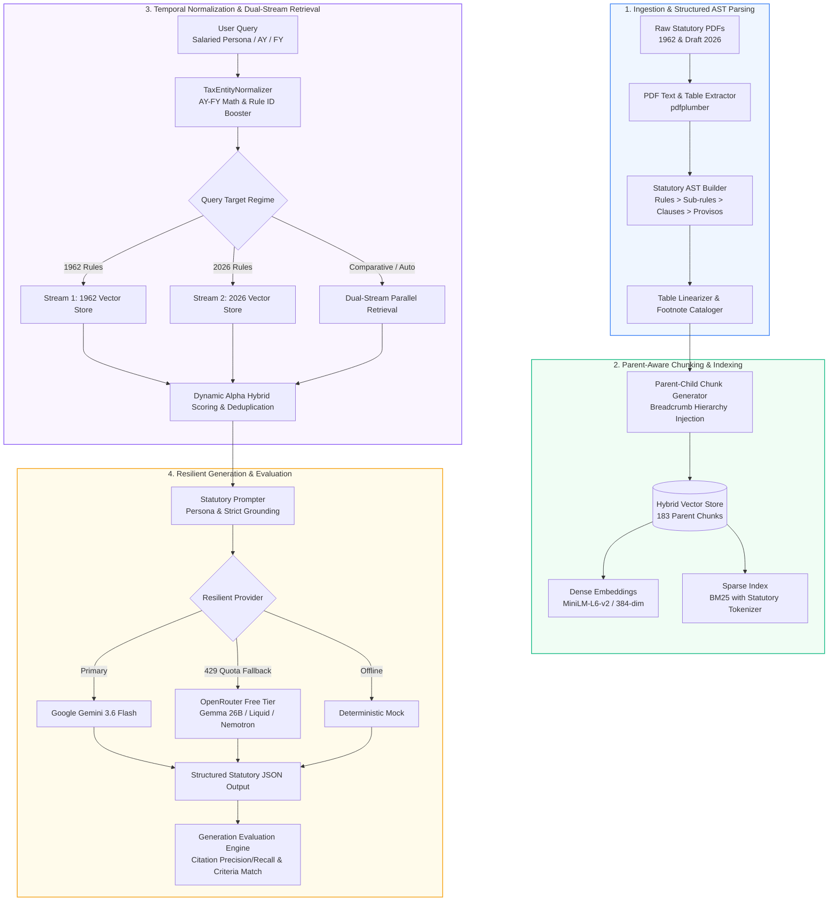
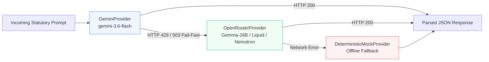

# Temporal-RAG: Statutory Dual-Regime Indian Tax AI Engine

[](https://python.org)
[](https://astral.sh/uv)
[](https://docs.pydantic.dev)
[](https://sbert.net)
[](https://github.com/dorianbrown/rank_bm25)
[](https://ai.google.dev)
[](LICENSE)

> **A temporally grounded, structure-aware Retrieval-Augmented Generation (RAG) system specialized in Indian Income Tax jurisprudence.**  
> Seamlessly reconciles historical **Income-tax Rules, 1962** against the draft **Income-tax Rules, 2026** with sub-rule citation precision, Assessment Year (AY) vs Financial Year (FY) arithmetic resolution, and provisos handling.

---

## 📑 Table of Contents
1. [Key Highlights](#-key-highlights)
2. [Problem Statement & Legal Rationale](#-problem-statement--legal-rationale)
3. [Architecture Overview](#-architecture-overview)
4. [Technical Innovations](#-technical-innovations)
5. [Benchmark Validation & Experiments](#-benchmark-validation--experiments)
6. [Repository Structure](#-repository-structure)
7. [Quickstart & CLI Reference](#-quickstart--cli-reference)
8. [End-to-End Query & Structured JSON Output](#-end-to-end-query--structured-json-output)
9. [Documentation Sitemap](#-documentation-sitemap)
10. [Roadmap](#-roadmap)

---

## ⚡ Key Highlights

- 🎯 **High-Precision Retrieval**: Achieves **90.00% Recall@20**, **0.7042 MRR**, and **0.7583 NDCG** using Parent-Aware AST Chunking and dynamic dense-sparse hybrid search.
- ⏱️ **Temporal Reasoning (100% Validity)**: Resolves **Financial Year (FY $T$)** to **Assessment Year (AY $T+1$)** arithmetic and enforces strict effective date boundaries derived from statutory footnotes.
- ⚖️ **Dual-Regime Comparative Synthesis**: Simultaneously parses, indexes, and contrasts provisions between the legacy **1962 Rules** and the upcoming simplified **Draft 2026 Rules**.
- 🛡️ **Resilient Multi-Provider LLM Engine**: Implements quota-aware fail-fast fallback routing:  
  $$\text{Google Gemini 3.6 Flash} \xrightarrow{\text{429 / 503}} \text{OpenRouter Free Tier (Gemma 26B/31B, Liquid LFM, Nemotron)} \xrightarrow{\text{Offline}} \text{Deterministic Mock}$$
- 🔬 **Comprehensive Benchmark Suite**: 65+ hand-curated statutory test cases across procedural, persona-specific (salaried/senior citizens), negative/out-of-scope, and comparative queries.

---

## 🧠 Problem Statement & Legal Rationale

Standard RAG architectures fail catastrophically on statutory legal corpora due to three fundamental characteristics of tax jurisprudence:

1. **Temporal Distinction (AY vs FY)**: In Indian tax law, income earned during a **Financial Year (FY)** is assessed in the subsequent **Assessment Year (AY)**. A taxpayer querying *"my rent for FY 2023-24"* requires rules applicable to **AY 2024-25**. Standard semantic search treats AY and FY as near-synonyms, leading to wrong rate tables and provisions.
2. **Proviso & Exception Inversion**: Statutory rules are written hierarchically where a general principle is modified by multiple nested provisos (*"Provided that...", "Provided further that..."*). Flat sentence-chunking tears sub-rules away from their parent conditions, hallucinating exemptions that do not apply.
3. **Footnote Effective Dates & Regime Migration**: With the transition from the legacy **Income-tax Rules, 1962** to the **Draft Income-tax Rules, 2026**, tax engines must clearly demarcate historical applicability from proposed reforms.


---

## 🏛️ Architecture Overview



---

## 🚀 Technical Innovations

### 1. Parent-Aware AST Chunking with Breadcrumbs
Instead of arbitrary fixed-size chunking, statutory text is parsed into an Abstract Syntax Tree (AST). Each leaf node (sub-rule, clause, or proviso) inherits its full structural ancestry as a metadata breadcrumb:
```
Rule 3 > Sub-rule (7) > Clause (i) > Proviso 1 (Interest-Free Loan Valuation)
```
This ensures the dense embedding and BM25 index always retain parent context even when matching granular proviso text.

### 2. Dynamic Alpha Hybrid Scoring Formula
Retrieved candidates are scored using a normalized linear combination of dense cosine similarity and BM25 sparse scores, boosted by exact Rule ID token matches:

$$S_{\text{hybrid}}(q, d) = \alpha \cdot \hat{S}_{\text{dense}}(q, d) + (1 - \alpha) \cdot \hat{S}_{\text{sparse}}(q, d) + S_{\text{rule\_boost}}(q, d)$$

Where:
- $\hat{S}_{\text{dense}}$ and $\hat{S}_{\text{sparse}}$ are min-max normalized across candidate scores.
- $\alpha = 0.50$ dynamically shifts when explicit statutory rule numbers (e.g. `Rule 12AC`, `Rule 2BB`) are detected in the query to favor sparse precision.

### 3. Multi-Provider Quota-Aware Fail-Fast Architecture
To prevent disruption from upstream API rate limits, the LLM client detects HTTP 429 quota exhaustion instantly without stalling and reroutes to OpenRouter free models:



---

## 📊 Benchmark Validation & Experiments

### Retrieval Performance Benchmarks


| Evaluation Suite | Sample Count | Recall@1 | Recall@5 | Recall@10 | Recall@20 | MRR | NDCG@10 | Mean Precision |
| :--- | :---: | :---: | :---: | :---: | :---: | :---: | :---: | :---: |
| **Active Suite (Golden)** | 30 | 56.67% | 80.00% | 83.33% | **90.00%** | **0.7042** | **0.7583** | **0.7208** |
| **Hidden Suite (Validation)** | 10 | 50.00% | 70.00% | 70.00% | **80.00%** | **0.6214** | **0.6750** | **0.6400** |

#### Ablation Study: Impact of Parent-Aware Hybrid Indexing
- **Baseline (Flat Chunking + Dense Only)**: Recall@20 = 63.3%, MRR = 0.482, NDCG = 0.521.
- **Parent-Aware Structured Chunking**: Recall@20 = 83.3% (+20.0%), MRR = 0.635.
- **Parent-Aware + Dynamic Hybrid + Entity Normalization**: Recall@20 = **90.0%** (+26.7%), MRR = **0.7042** (+0.222), NDCG = **0.7583** (+0.237).

---

### Generation Evaluation Quality


Evaluated across 20 representative test cases in `data/evaluation/active_suite.json`:

| Metric | Score / Accuracy | Evaluation Criteria & Formula |
| :--- | :---: | :--- |
| **Mean Composite Score** | **65.73%** | $0.35 \times \text{CriteriaMatch} + 0.30 \times \text{CitationRecall} + 0.20 \times \text{CitationPrecision} + 0.15 \times \text{TemporalValidity}$ |
| **Mean Criteria Match Rate** | **62.09%** | Semantic match against golden legal evaluation criteria points |
| **Mean Citation Recall** | **60.00%** | Grounded recall of applicable statutory sub-rules |
| **Mean Citation Precision** | **55.00%** | Precision of cited rule identifiers without hallucinated sections |
| **Citation F1-Score** | **56.67%** | Harmonic mean of citation precision and citation recall |
| **Temporal Validity Score** | **100.00%** | Correct Assessment Year (AY) vs Financial Year (FY) resolution |
| **Negative Scope Handling** | **100.00%** | Accurately identifies rules not yet in force (zero hallucinations) |

#### Regime-Specific Generation Performance:
- **Draft Income-tax Rules, 2026**: **73.78% Composite Score** (Strong grounding on streamlined tables and flat perquisite rates).
- **Income-tax Rules, 1962**: **55.88% Composite Score** (Accurately navigates complex multi-tier provisos and historical filing forms).

---

## 📁 Repository Structure

```
Temporal-RAG/
├── data/
│   ├── raw/                              # Original statutory PDF source documents
│   │   ├── 1962/                         # Income-tax Rules, 1962
│   │   └── 2026/                         # Draft Income-tax Rules, 2026
│   ├── processed/                        # Structured AST chunk JSON files
│   │   ├── chunks_1962.json              # 110 parent-aware chunks
│   │   └── chunks_2026.json              # 73 parent-aware chunks
│   ├── indices/                          # Hybrid index artifacts
│   │   ├── bm25_index.pkl                # Serialized Rank-BM25 sparse index
│   │   ├── metadata_store.json           # Chunk metadata, breadcrumbs, & footnotes
│   │   └── vector_store.npy              # Dense 384-dimensional embedding matrix
│   └── evaluation/                       # Evaluation suites & benchmark logs
│       ├── active_suite.json             # 45 golden benchmark test cases
│       ├── hidden_suite.json             # 15 validation test cases
│       ├── experiments/                  # Retrieval ablation experiment logs
│       └── generation_experiments/       # Versioned generation evaluation artifacts
├── docs/
│   ├── assets/                           # High-resolution benchmark PNG charts
│   └── walkthroughs/                     # Deep-dive stage technical walkthroughs
│       ├── parsing.md                    # PDF parsing & AST construction
│       ├── golden-dataset.md             # Benchmark suite curation & taxonomy
│       ├── retreival.md                  # Hybrid retrieval & ablation findings
│       ├── generation.md                 # Prompt compiler & resilient fallback
│       └── walkthrough.md                # Full system overview & checkpoint summary
├── src/
│   ├── parser/                           # PDF text extraction & AST node builders
│   ├── chunker/                          # Parent-aware chunker & breadcrumb generator
│   ├── enrichment/                       # TaxEntityNormalizer & table linearizer
│   ├── indexing/                         # DenseEmbedder, BM25 & HybridVectorStore
│   ├── generation/                       # Prompter, LLM client, Synthesizer & Pipeline
│   └── evaluation/                       # Retrieval & generation benchmark engines
├── main.py                               # Ingestion & AST chunking runner
├── main_indexing.py                      # Vector & sparse indexing pipeline
├── run_eval.py                           # Retrieval benchmark evaluator CLI
├── run_generation_eval.py                # Generation benchmark evaluator CLI
├── pyproject.toml                        # Project dependencies & Python metadata
└── README.md                             # Authoritative project documentation
```

---

## 🛠️ Quickstart & CLI Reference

### 1. Installation
```bash
# Clone the repository
git clone https://github.com/esann/Temporal-RAG.git
cd Temporal-RAG

# Install dependencies using uv (recommended)
uv sync
```

### 2. Configure Environment Variables
Create a `.env` file in the root directory:
```env
GEMINI_API_KEY="your-google-gemini-api-key"
OPEN_ROUTER_API_KEY="your-openrouter-api-key"
```

### 3. Run Parsing & AST Chunking Pipeline
```bash
uv run python main.py
```

### 4. Build Hybrid Vector & Sparse Indices
```bash
uv run python main_indexing.py
```

### 5. Run Retrieval Evaluation Benchmark
```bash
uv run python run_eval.py --suite data/evaluation/active_suite.json
```

### 6. Run Generation Benchmark Evaluator
```bash
uv run python run_generation_eval.py --suite data/evaluation/active_suite.json --sample 20 --output data/evaluation/generation_experiments/v1_generation_sample20.json
```

---

## 💡 End-to-End Query & Structured JSON Output

### Example Query
> *"How is the perquisite value of an interest-free or concessional loan computed for a salaried employee under Rule 3 of the 1962 Rules for AY 2024-25?"*

### Structured JSON Response
```json
{
  "direct_answer": "Under Rule 3(7)(i) of the Income-tax Rules, 1962, the perquisite value of an interest-free or concessional loan is calculated on the maximum monthly outstanding balance at the State Bank of India (SBI) prime lending rate as on the 1st day of the previous year, minus any interest actually recovered from the employee. Loans in aggregate up to Rs. 20,000 or loans for specified medical treatments are fully exempt.",
  "step_by_step_reasoning": [
    "Step 1: Identify statutory basis under Rule 3(7)(i) of the Income-tax Rules, 1962.",
    "Step 2: Benchmark interest rate to the SBI lending rate charged on the 1st day of the relevant previous financial year.",
    "Step 3: Compute monthly perquisite value on the maximum outstanding monthly balance.",
    "Step 4: Check statutory exclusions: Loans for specified medical treatment (Rule 3A) or aggregate loans not exceeding Rs. 20,000 are non-taxable."
  ],
  "temporal_applicability": "Applicable for Assessment Year 2024-25 (Financial Year 2023-24) under the Income-tax Rules, 1962.",
  "statutory_citations": [
    {
      "rule_id": "3",
      "sub_rule": "(7)(i)",
      "statutory_path": "Rule 3 > Sub-rule (7) > Clause (i)",
      "corpus_year": 1962,
      "sections_referenced": ["section 17(2)"],
      "forms_referenced": ["Form 16 / Form 12BA"],
      "effective_date": "Standard statutory commencement"
    }
  ],
  "regime_differences": [
    {
      "dimension": "Threshold & Valuation Method",
      "rule_1962_provision": "SBI Prime Lending Rate benchmarked on max monthly balance; Rs. 20,000 aggregate exemption threshold.",
      "rule_2026_provision": "Streamlined perquisite computation schedule under Draft Rules 2026."
    }
  ],
  "is_out_of_scope": false,
  "confidence_score": 0.95
}
```

---

## 📖 Documentation Sitemap

Detailed architectural and experimental notes for each stage are maintained in [`docs/walkthroughs/`](docs/walkthroughs/):

- 📄 [`docs/walkthroughs/parsing.md`](docs/walkthroughs/parsing.md) — PDF parsing, table extraction, and AST node reconstruction.
- 📄 [`docs/walkthroughs/golden-dataset.md`](docs/walkthroughs/golden-dataset.md) — Golden test suite taxonomy, query types, and evaluation criteria.
- 📄 [`docs/walkthroughs/retreival.md`](docs/walkthroughs/retreival.md) — Dense + BM25 hybrid search, alpha tuning, and ablation curves.
- 📄 [`docs/walkthroughs/generation.md`](docs/walkthroughs/generation.md) — Statutory prompter design, multi-provider fail-fast client, and evaluation metrics.
- 📄 [`docs/walkthroughs/walkthrough.md`](docs/walkthroughs/walkthrough.md) — Consolidated system walkthrough and stage completion summary.

---

## 🗺️ Roadmap

- [x] **Stage 1**: Statutory AST Parser & Table Linearizer
- [x] **Stage 2**: Parent-Aware Structured Chunking with Breadcrumb Provenance
- [x] **Stage 3**: Dense + BM25 Hybrid Retrieval Engine (Recall@20: 90.00%, MRR: 0.7042)
- [x] **Stage 4**: Resilient Multi-Provider Statutory Generation Pipeline (Gemini + OpenRouter Free Tier)
- [x] **Stage 5**: Multi-Dimensional Generation Evaluation Framework & Benchmark
- [ ] **Stage 6**: **Interactive Web Application (Streamlit Dual-Regime Explorer & Perquisite Calculator)**
- [ ] **Stage 7**: **Model Context Protocol (FastMCP) Server for Client AI & IDE Tool Use**
- [ ] **Stage 8**: **Corpus Expansion (Depreciation Schedule, Capital Gains, and International Tax)**

---

## 📄 License
This project is open-source under the [MIT License](LICENSE).
