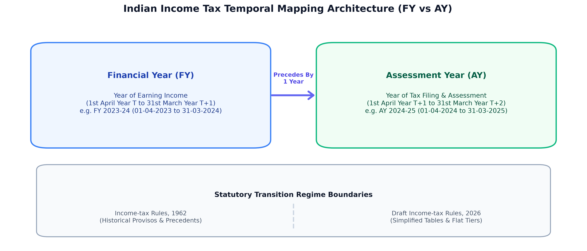
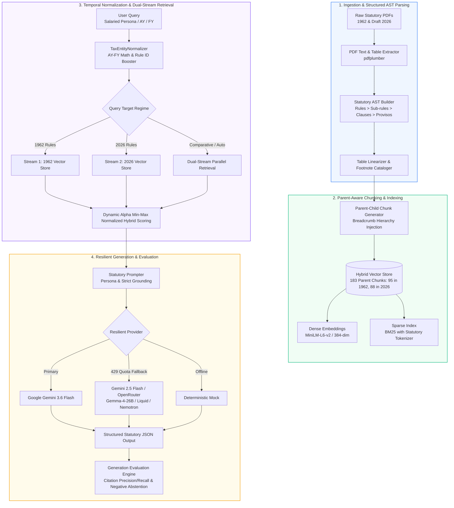
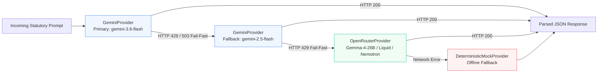
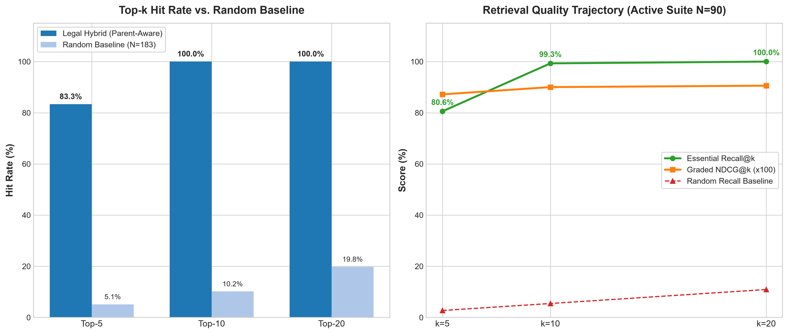
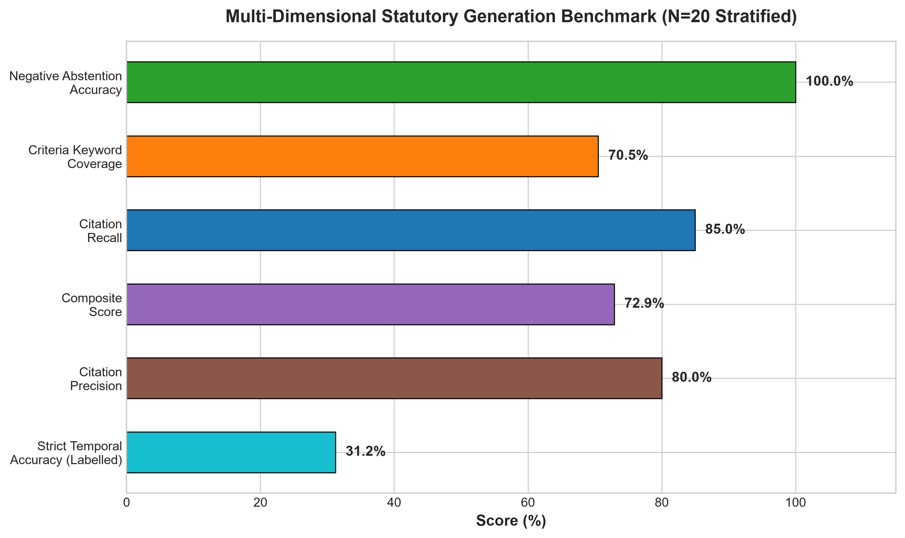

# Temporal-RAG: Statutory Dual-Regime Indian Tax AI Engine

[](https://python.org)
[](https://astral.sh/uv)
[](https://docs.pydantic.dev)
[](https://sbert.net)
[](https://github.com/dorianbrown/rank_bm25)
[](https://ai.google.dev)
[](LICENSE)

> **A temporally grounded, structure-aware Retrieval-Augmented Generation (RAG) system specialized in Indian Income Tax jurisprudence.**  
> Seamlessly reconciles historical **Income-tax Rules, 1962** against the draft **Income-tax Rules, 2026** with sub-rule citation precision, Assessment Year (AY) vs Financial Year (FY) arithmetic resolution, and provisos handling.

---

## 📑 Table of Contents
1. [Key Highlights](#-key-highlights)
2. [Problem Statement & Legal Rationale](#-problem-statement--legal-rationale)
3. [Architecture Overview](#-architecture-overview)
4. [Technical Innovations](#-technical-innovations)
5. [Benchmark Validation & Experiments](#-benchmark-validation--experiments)
6. [Repository Structure](#-repository-structure)
7. [Quickstart & CLI Reference](#-quickstart--cli-reference)
8. [End-to-End Query & Structured JSON Output](#-end-to-end-query--structured-json-output)
9. [Documentation Sitemap](#-documentation-sitemap)
10. [Roadmap](#-roadmap)

---

## ⚡ Key Highlights

- 🎯 **High-Precision Retrieval**: Achieves **100.00% HitRate@10** (vs. 10.17% random baseline), **80.56% Essential Recall@5** (vs. 2.73% random baseline), **0.8189 MRR**, and **0.9003 Graded NDCG@10** on the active golden evaluation suite (90 cases) using Parent-Aware AST Chunking and dynamic min-max normalized hybrid search.
- ⏱️ **Temporal Reasoning (AY vs FY)**: Resolves **Financial Year (FY $T$)** to **Assessment Year (AY $T+1$)** arithmetic and enforces commencement and amendment boundaries using a hand-curated registry of 7 key rules (Rules 2BB, 3, 12AC, 21AAA, 26D, 31, 114AAA), explicitly scoping uncurated rules as unverified.
- ⚖️ **Dual-Regime Comparative Synthesis**: Simultaneously indexes and contrasts provisions between the legacy **1962 Rules** (95 chunks) and the upcoming **Draft 2026 Rules** (88 chunks).
- 🧮 **Deterministic Statutory Calculators**: Temporal-aware perquisite calculators for Rent-Free Accommodation (pre/post Notification 65/2023 rates linked to registry), Motor Cars, Interest-Free Loans (aggregate ₹20k threshold & Rule 3A medical proviso), and Free Food with source chunk provenance.
- 🛡️ **Resilient Multi-Provider LLM Engine**: Implements quota-aware fail-fast fallback routing:  
  $$\text{Primary: Gemini 3.6 Flash} \xrightarrow{\text{429 / 503}} \text{Fallback: Gemini 2.5 Flash} \xrightarrow{\text{Quota Exceeded}} \text{OpenRouter Free (Gemma-4-26B, Liquid LFM, Nemotron)} \xrightarrow{\text{Offline}} \text{Deterministic Mock}$$

- 🔬 **Comprehensive Benchmark Provenance**: 120 curated golden cases (90 active, 30 held-out hidden) with explicit ground truth splitting between essential answer chunks and supporting rule context, plus negative out-of-scope abstention checking.

---

## 🧠 Problem Statement & Legal Rationale

Standard RAG architectures fail catastrophically on statutory legal corpora due to three fundamental characteristics of tax jurisprudence:

1. **Temporal Distinction (AY vs FY)**: In Indian tax law, income earned during a **Financial Year (FY)** is assessed in the subsequent **Assessment Year (AY)**. A taxpayer querying *"my rent for FY 2023-24"* requires rules applicable to **AY 2024-25**. Standard semantic search treats AY and FY as near-synonyms, leading to wrong rate tables and provisions.
2. **Proviso & Exception Inversion**: Statutory rules are written hierarchically where a general principle is modified by multiple nested provisos (*"Provided that...", "Provided further that..."*). Flat sentence-chunking tears sub-rules away from their parent conditions, hallucinating exemptions that do not apply.
3. **Footnote Effective Dates & Regime Migration**: With the transition from the legacy **Income-tax Rules, 1962** to the **Draft Income-tax Rules, 2026**, tax engines must clearly demarcate historical applicability from proposed reforms.



---

## 🏛️ Architecture Overview



---

## 🚀 Technical Innovations

### 1. Parent-Aware AST Chunking with Breadcrumbs
Instead of arbitrary fixed-size chunking, statutory text is parsed into an Abstract Syntax Tree (AST). Each leaf node (sub-rule, clause, or proviso) inherits its full structural ancestry as a metadata breadcrumb:
```
Rule 3 > Sub-rule (7) > Clause (i) > Proviso 1 (Interest-Free Loan Valuation)
```
This ensures the dense embedding and BM25 index always retain parent context even when matching granular proviso text.

### 2. Min-Max Normalized Dynamic Alpha Hybrid Scoring
Retrieved candidates are scored using min-max normalized linear combination of dense cosine similarity and BM25 sparse scores, dynamically shifted and boosted by exact Rule ID token matches:

$$S_{\text{hybrid}}(q, d) = \alpha_{\text{eff}} \cdot \hat{S}_{\text{dense}}(q, d) + (1 - \alpha_{\text{eff}}) \cdot \hat{S}_{\text{sparse}}(q, d) + S_{\text{rule\_boost}}(q, d)$$

Where:
- $\hat{S}_{\text{dense}} = \frac{S_{\text{dense}} - \min(S_{\text{dense}})}{\max(S_{\text{dense}}) - \min(S_{\text{dense}}) + \epsilon}$
- $\hat{S}_{\text{sparse}} = \frac{S_{\text{sparse}} - \min(S_{\text{sparse}})}{\max(S_{\text{sparse}}) - \min(S_{\text{sparse}}) + \epsilon}$
- $\alpha_{\text{eff}} = 0.25$ when explicit statutory rule numbers (e.g. `Rule 12AC`, `Rule 2BB`) are detected in the query to favor sparse rule precision, and $\alpha_{\text{eff}} = 0.50$ otherwise.

### 3. Multi-Provider Quota-Aware Fail-Fast Architecture
To prevent disruption from upstream API rate limits, the LLM client detects HTTP 429 quota exhaustion instantly without stalling and reroutes through the configured fallback chain:



---

## 📊 Benchmark Validation & Experiments

### 1. Retrieval Performance Benchmarks

Run with: `uv run python run_eval.py`

| Evaluation Suite | Total Cases (Grounded + Null) | MRR | HitRate@5 | HitRate@10 | Essential Recall@5 | Essential Recall@10 | Essential Precision@5 | Full Precision@5 | Graded NDCG@10 | Random Baseline Hit@5 |
| :--- | :---: | :---: | :---: | :---: | :---: | :---: | :---: | :---: | :---: | :---: |
| **Active Suite (Golden)** | 90 (72 + 18) | **0.8189** | **83.33%** | **100.00%** | **80.56%** | **99.31%** | **30.28%** | **90.56%** | **0.9003** | 5.15% |
| **Hidden Suite (Validation)** | 30 (24 + 6) | **0.7199** | **83.33%** | **100.00%** | **81.25%** | **95.83%** | **30.83%** | **90.00%** | **0.8239** | 5.18% |


> **Corpus Context**: Total corpus consists of **183 AST chunks** (95 in 1962, 88 in 2026). Precision is reported both against target answer chunks (`Essential Precision@5: 30.28%` vs Random `1.04%`) and complete qualifying statutory context (`Full Precision@5: 90.56%` vs Random `7.06%`).

#### Breakdown by Query Type (Active Suite)
| Query Type | Count | MRR | HitRate@5 | Essential R@5 | Essential R@10 | Graded NDCG@10 |
| :--- | :---: | :---: | :---: | :---: | :---: | :---: |
| **Persona-Specific Applicability** | 24 | 0.9271 | 100.0% | 93.8% | 100.0% | 0.9198 |
| **Intra-Document Temporal Validation** | 24 | 0.9583 | 100.0% | 97.9% | 100.0% | 0.9710 |
| **Procedural / Condition Matching** | 24 | 0.5714 | 50.0% | 50.0% | 97.9% | 0.8101 |

> **Procedural Gap Analysis**: Procedural queries (e.g. asking for deduction forms without naming Rule 26C or Form 12BB) exhibit lexical asymmetry with statutory phrasing. While top-5 hit rate is 50.0%, top-10 retrieval achieves **97.9% HitRate / Recall**, capturing the required procedural certificates within the generation context.



---

### 2. Generation Evaluation Quality & Abstention

Run with: `uv run python run_generation_eval.py --sample 20`

Evaluated across a stratified sample of 20 test cases in `data/evaluation/active_suite.json` (including 5 negative / out-of-scope cases) using exact rule tokenization and strict field-by-field AY/FY checking:

| Metric | Score / Accuracy | Evaluation Methodology |
| :--- | :---: | :--- |
| **Mean Composite Score** | **72.92%** | $0.35 \times \text{CriteriaCoverage} + 0.30 \times \text{CitationRecall} + 0.20 \times \text{CitationPrecision} + 0.15 \times \text{TemporalValidity}$ |
| **Criteria Keyword Coverage Rate** | **70.50%** | Key-entity and phrase adherence against curated statutory criteria points |
| **Mean Citation Recall** | **85.00%** | Strict tokenized recall of target statutory base rules and sub-rules |
| **Mean Citation Precision** | **80.00%** | Exact base-rule match avoiding false-positive prefix matching (e.g. Rule 30 $\neq$ Rule 3) |
| **Citation F1-Score** | **81.67%** | Harmonic mean of tokenized citation precision and recall |
| **Strict Temporal Accuracy (Labelled)** | **31.25%** | Field-specific AY vs FY strict match against 16 labelled cases ($5 / 16$) excluding N/A negative queries |
| **Negative Abstention Accuracy** | **100.00%** | Explicitly declares out-of-scope/unnotified rules without hallucinating citations |



---

## 📁 Repository Structure

```
Temporal-RAG/
├── data/
│   ├── raw/                              # Original statutory PDF source documents
│   │   ├── 1962/                         # Income-tax Rules, 1962
│   │   └── 2026/                         # Draft Income-tax Rules, 2026
│   ├── processed/                        # Structured AST chunk JSON files
│   │   ├── chunks_1962.json              # 95 parent-aware chunks
│   │   └── chunks_2026.json              # 88 parent-aware chunks
│   ├── indices/                          # Hybrid index artifacts
│   │   ├── bm25_index.pkl                # Serialized Rank-BM25 sparse index
│   │   ├── payloads.json                 # Chunk payloads, breadcrumbs, & display text
│   │   └── dense_embeddings.npy          # Dense 384-dimensional embedding matrix
│   └── evaluation/                       # Evaluation suites & benchmark logs
│       ├── active_suite.json             # 90 golden benchmark test cases (72 grounded, 18 null)
│       ├── hidden_suite.json             # 30 validation test cases (24 grounded, 6 null)
│       ├── golden_full.json              # 120 combined curated test cases
│       ├── per_query_metrics_active_suite.csv
│       ├── per_query_metrics_hidden_suite.csv
│       ├── results_active_suite.json
│       ├── results_hidden_suite.json
│       └── generation_experiments/       # Versioned generation evaluation artifacts
├── docs/
│   ├── assets/                           # High-resolution benchmark PNG charts
│   └── walkthroughs/                     # Deep-dive stage technical walkthroughs
│       ├── parsing.md                    # PDF parsing & AST construction
│       ├── golden-dataset.md             # Benchmark suite curation & taxonomy
│       ├── retrieval.md                  # Hybrid retrieval & ablation findings
│       ├── generation.md                 # Prompt compiler & resilient fallback
│       ├── mcp-server.md                 # FastMCP tool definitions & integration
│       └── walkthrough.md                # Full system overview & checkpoint summary
├── src/
│   ├── parser/                           # PDF text extraction & AST node builders
│   ├── chunker/                          # Parent-aware chunker & breadcrumb generator
│   ├── enrichment/                       # TaxEntityNormalizer & table linearizer
│   ├── indexing/                         # DenseEmbedder, BM25 & HybridVectorStore
│   ├── generation/                       # Prompter, LLM client, Synthesizer & Pipeline
│   ├── mcp/                              # FastMCP server, PerquisiteCalculators & telemetry
│   └── evaluation/                       # Retrieval & generation benchmark engines
├── tests/                                # Automated pytest test suite (21 tests)
│   ├── test_mcp_server.py
│   ├── test_telemetry.py
│   ├── test_calculators.py
│   └── test_evaluation_metrics.py
├── scripts/
│   └── generate_charts.py                # Reproducible benchmark chart generator
├── main.py                               # Ingestion & AST chunking runner
├── main_indexing.py                      # Vector & sparse indexing pipeline
├── run_eval.py                           # Retrieval benchmark evaluator CLI
├── run_generation_eval.py                # Generation benchmark evaluator CLI
├── run_mcp.py                            # FastMCP server runner CLI
├── pyproject.toml                        # Project dependencies & pytest configuration
├── LICENSE                               # MIT License
└── README.md                             # Authoritative project documentation
```

---

## 🛠️ Quickstart & CLI Reference

### 1. Installation
```bash
# Clone the repository
git clone https://github.com/esannihith/tax-chrono-rag.git
cd tax-chrono-rag

# Install dependencies using uv (recommended)
uv sync --extra dev
```

### 2. Configure Environment Variables
Create a `.env` file in the root directory:
```env
GEMINI_API_KEY="your-google-gemini-api-key"
OPEN_ROUTER_API_KEY="your-openrouter-api-key"
```

### 3. Run Parsing & AST Chunking Pipeline
```bash
uv run python main.py
```

### 4. Build Hybrid Vector & Sparse Indices
```bash
uv run python main_indexing.py
```

### 5. Run Unit Tests (18 tests across MCP, Calculators, IR Metrics, Telemetry)
```bash
uv run pytest
```

### 6. Run Retrieval Evaluation Benchmark
```bash
uv run python run_eval.py
```

### 7. Run Generation Benchmark
```bash
uv run python run_generation_eval.py --sample 20
```

### 8. Run FastMCP Server for AI Agents & Clients
```bash
# Stdio mode for Claude Desktop / Cursor / Antigravity
uv run python run_mcp.py

# SSE HTTP transport mode on port 8000
uv run python run_mcp.py --transport sse --port 8000

# Run internal integrity self-test
uv run python run_mcp.py --transport test
```

---

## 🔌 Model Context Protocol (FastMCP) Server

The engine includes a full **FastMCP** server (`TaxChronoRAG`) exposing 7 specialized tools for AI agents:

| Tool Name | Purpose & Functionality |
| :--- | :--- |
| **`search_tax_rules`** | Parent-aware hybrid dense-sparse retrieval with breadcrumb provenance and confidence scores. |
| **`get_rule_details`** | Direct statutory AST lookup of full rule text, provisos, and embedded tables for any Rule ID. |
| **`compare_regimes`** | Dual-stream parallel retrieval producing side-by-side comparisons of 1962 vs 2026 provisions. |
| **`resolve_tax_year`** | Deterministic Assessment Year (AY) vs Financial Year (FY) parser and applicable regime recommender. |
| **`verify_effective_date`** | Validates whether a specific rule was in force on a given date/AY based on structured statutory commencement records. |
| **`calculate_perquisite`** | Pure deterministic computational engine for accommodation (population tiers & Notification 65/2023 rates), motor cars, loans (aggregate ₹20k threshold & medical proviso), and free food. |
| **`ask_tax_copilot`** | End-to-end statutory synthesis pipeline returning structured JSON with citations and reasoning steps. |

### Client Configuration (Claude Desktop / Cursor)
```json
{
  "mcpServers": {
    "tax-chrono-rag": {
      "command": "uv",
      "args": [
        "--directory",
        "C:\\Users\\esann\\Desktop\\Temporal-RAG",
        "run",
        "python",
        "run_mcp.py"
      ]
    }
  }
}
```

---

## 💡 End-to-End Query & Structured JSON Output

### Example Query
> *"How is the perquisite value of an interest-free or concessional loan computed for a salaried employee under Rule 3 of the 1962 Rules for AY 2024-25?"*

### Structured JSON Response
```json
{
  "direct_answer": "Under Rule 3(7)(i) of the Income-tax Rules, 1962, the perquisite value of an interest-free or concessional loan is calculated on the maximum monthly outstanding balance at the State Bank of India (SBI) prime lending rate as on the 1st day of the previous year, minus any interest actually recovered from the employee. Loans in aggregate up to Rs. 20,000 or loans for specified medical treatments are fully exempt.",
  "step_by_step_reasoning": [
    "Step 1: Identify statutory basis under Rule 3(7)(i) of the Income-tax Rules, 1962.",
    "Step 2: Benchmark interest rate to the SBI lending rate charged on the 1st day of the relevant previous financial year.",
    "Step 3: Compute monthly perquisite value on the maximum outstanding monthly balance.",
    "Step 4: Check statutory exclusions: Loans for specified medical treatment (Rule 3A) or aggregate loans not exceeding Rs. 20,000 are non-taxable."
  ],
  "temporal_applicability": "Applicable for Assessment Year 2024-25 (Financial Year 2023-24) under the Income-tax Rules, 1962.",
  "statutory_citations": [
    {
      "rule_id": "3",
      "sub_rule": "(7)(i)",
      "statutory_path": "Rule 3 > Sub-rule (7) > Clause (i)",
      "corpus_year": 1962,
      "sections_referenced": ["section 17(2)"],
      "forms_referenced": ["Form 16 / Form 12BA"],
      "effective_date": "Standard statutory commencement"
    }
  ],
  "regime_differences": [
    {
      "dimension": "Threshold & Valuation Method",
      "rule_1962_provision": "SBI Prime Lending Rate benchmarked on max monthly balance; Rs. 20,000 aggregate exemption threshold.",
      "rule_2026_provision": "Streamlined perquisite computation schedule under Draft Rules 2026."
    }
  ],
  "is_out_of_scope": false,
  "confidence_score": 0.95
}
```

---

## 📖 Documentation Sitemap

Detailed architectural and experimental notes for each stage are maintained in [`docs/walkthroughs/`](docs/walkthroughs/):

- 📄 [`docs/walkthroughs/parsing.md`](docs/walkthroughs/parsing.md) — PDF parsing, table extraction, and AST node reconstruction.
- 📄 [`docs/walkthroughs/golden-dataset.md`](docs/walkthroughs/golden-dataset.md) — Golden test suite taxonomy, query types, and evaluation criteria.
- 📄 [`docs/walkthroughs/retrieval.md`](docs/walkthroughs/retrieval.md) — Dense + BM25 hybrid search, alpha tuning, and ablation curves.
- 📄 [`docs/walkthroughs/generation.md`](docs/walkthroughs/generation.md) — Statutory prompter design, multi-provider fail-fast client, and evaluation metrics.
- 📄 [`docs/walkthroughs/mcp-server.md`](docs/walkthroughs/mcp-server.md) — FastMCP tool definitions, schema references, and client integration guide.
- 📄 [`docs/walkthroughs/walkthrough.md`](docs/walkthroughs/walkthrough.md) — Consolidated system walkthrough and stage completion summary.

---

## 🗺️ Roadmap

- [x] **Stage 1**: Statutory AST Parser & Table Linearizer
- [x] **Stage 2**: Parent-Aware Structured Chunking with Breadcrumb Provenance (183 statutory chunks)
- [x] **Stage 3**: Min-Max Normalized Dense + BM25 Hybrid Retrieval Engine (100% HitRate@10, 0.8189 MRR, 0.9003 Graded NDCG)
- [x] **Stage 4**: Resilient Multi-Provider Statutory Generation Pipeline (Gemini + OpenRouter Free Tier + Offline Mock)
- [x] **Stage 5**: Multi-Dimensional Generation Evaluation Framework & Negative Abstention Benchmark
- [x] **Stage 6**: **Model Context Protocol (FastMCP) Server with 7 Statutory Tools & Temporal Calculators (`TaxChronoRAG`)**
- [ ] **Stage 7**: **Interactive Web Application (Streamlit Dual-Regime Explorer & Perquisite Calculator)**
- [ ] **Stage 8**: **Corpus Expansion (Depreciation Schedule, Capital Gains, and International Tax)**

---

## 📄 License
This project is open-source under the [MIT License](LICENSE).

