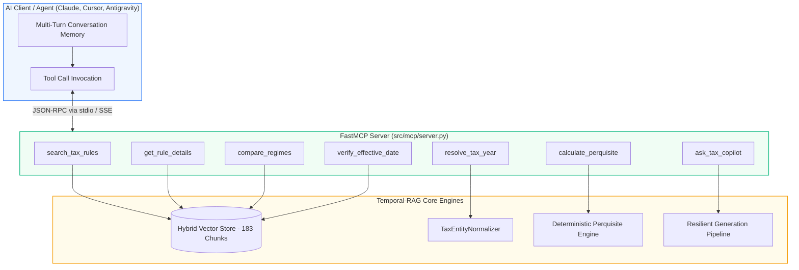

# Model Context Protocol (FastMCP) Server Specification

## 1. Overview & Architecture

The **Temporal-RAG FastMCP Server** (`TaxChronoRAG`) exposes the dual-regime statutory retrieval engine, legal entity normalizer, deterministic perquisite calculators, and synthesis pipeline as standardized tools for AI agents and LLM clients.



---

## 2. Tool Reference & Schemas

### 1. `search_tax_rules`
Performs parent-aware hybrid dense-sparse retrieval across the statutory corpus with breadcrumb hierarchy provenance.
- **Parameters**:
  - `query` (*str*): Tax question or legal keywords (e.g. `"perquisite valuation of motor car"`).
  - `target_regime` (*str*, default: `"both"`): `"1962"`, `"2026"`, or `"both"`.
  - `top_k` (*int*, default: `5`): Number of ranked chunks to return.

### 2. `get_rule_details`
Retrieves the complete text, sub-rules, provisos, and tables for an explicit rule number.
- **Parameters**:
  - `rule_id` (*str*): Rule identifier (e.g. `"3"`, `"12AC"`, `"2BB"`, `"114B"`).
  - `regime` (*str*, default: `"1962"`): `"1962"` or `"2026"`.

### 3. `compare_regimes`
Executes parallel dual-stream retrieval to generate a structured side-by-side comparison between the legacy **1962 Rules** and the **Draft 2026 Rules**.
- **Parameters**:
  - `topic` (*str*): Topic to compare (e.g. `"rent free accommodation"`, `"interest free loan"`, `"filing deadline"`).
  - `top_k_per_regime` (*int*, default: `2`): Chunks per regime.

### 4. `resolve_tax_year`
Resolves Assessment Year (AY) and Financial Year (FY) arithmetic under Indian tax law.
- **Parameters**:
  - `year_input` (*str*): Year string (e.g. `"FY 2023-24"`, `"AY 2024-25"`, `"2024"`).
- **Output**:
  - `resolved_financial_year`: e.g. `"FY 2023-2024"`
  - `resolved_assessment_year`: e.g. `"AY 2024-2025"`
  - `default_applicable_regime`: `"1962"` or `"2026"`

### 5. `verify_effective_date`
Checks statutory footnote provenance to determine if a rule or amendment was legally in force for a given period.
- **Parameters**:
  - `rule_id` (*str*): e.g. `"12AC"`.
  - `date_or_ay` (*str*): e.g. `"AY 2020-21"`.

### 6. `calculate_perquisite`
Pure deterministic computational engine for Indian tax perquisite valuations under Rule 3.
- **Parameters**:
  - `perquisite_type` (*str*): `"rent_free_accommodation"`, `"motor_car"`, `"interest_free_loan"`, or `"free_food"`.
  - `parameters` (*dict*):
    - **Rent-Free Accommodation**: `salary_for_period`, `population_tier` (`">40L"`, `"15L-40L"`, `"<=15L"`), `is_owned_by_employer`, `actual_lease_rent_paid`, `is_furnished`, `furniture_original_cost`, `amount_recovered`.
    - **Motor Car**: `cubic_capacity_cc`, `is_employer_owned_or_hired`, `is_employer_expenses_met`, `usage_type` (`"mixed"`, `"official"`, `"personal"`), `is_driver_provided`, `months_used`, `amount_recovered`.
    - **Interest-Free Loan**: `max_outstanding_monthly_balance`, `actual_interest_rate_charged_pct`, `sbi_benchmark_rate_pct`, `is_medical_treatment_specified_disease`, `months_outstanding`.
    - **Free Food**: `cost_per_meal`, `num_meals_per_day`, `working_days`, `amount_recovered_per_meal`.

### 7. `ask_tax_copilot`
Full end-to-end statutory synthesis pipeline returning structured JSON with direct answer, reasoning steps, temporal applicability, and sub-rule citations.

---

## 3. Client Configuration

### Claude Desktop (`claude_desktop_config.json`)
```json
{
  "mcpServers": {
    "tax-chrono-rag": {
      "command": "uv",
      "args": [
        "--directory",
        "C:\\Users\\esann\\Desktop\\Temporal-RAG",
        "run",
        "python",
        "run_mcp.py",
        "--transport",
        "stdio"
      ]
    }
  }
}
```

### Cursor IDE (`.cursor/mcp.json`)
```json
{
  "mcpServers": {
    "tax-chrono-rag": {
      "command": "uv",
      "args": [
        "--directory",
        "C:\\Users\\esann\\Desktop\\Temporal-RAG",
        "run",
        "python",
        "run_mcp.py"
      ]
    }
  }
}
```

---

## 4. Running the Server & Telemetry CLI

```bash
# Run in default stdio mode for desktop AI clients
uv run python run_mcp.py

# Run in SSE HTTP mode on port 8000
uv run python run_mcp.py --transport sse --port 8000

# Run integrity self-test suite
uv run python run_mcp.py --transport test

# Print live query & retrieval telemetry statistics
uv run python run_mcp.py --analyze-telemetry

# Export collected user queries to standard RAG evaluation JSON suite
uv run python run_mcp.py --export-telemetry data/evaluation/telemetry_suite.json
```

---

## 5. Zero-Latency Asynchronous Telemetry Architecture

To enable continuous evaluation without impacting tool execution speed:

1. **Sub-Millisecond Overhead ($< 0.01\text{ ms}$)**:
   - Tool execution threads push structured log events into an in-memory `queue.Queue` via non-blocking `put_nowait()`.
   - The tool immediately returns its result to the client without waiting for disk I/O.
2. **Dedicated Daemon Worker Thread**:
   - `MCPTelemetryWriter` drains the queue in batches and appends to `data/logs/mcp_telemetry.jsonl` every 10 events or every 1.0 second.
3. **Data Captured for RAG Benchmarking**:
   - Query text, target regime, top-k parameters.
   - Retrieved statutory `chunk_id` list and full breadcrumb paths.
   - Resolved Financial Year (`detected_fy`) and Assessment Year (`detected_ay`).
   - Execution duration (`duration_ms`), citations generated, and taxable valuation results.
4. **Offline Evaluation Conversion**:
   - `src/evaluation/telemetry_analyzer.py` converts real user query logs directly into golden benchmark test suites for regression testing.

